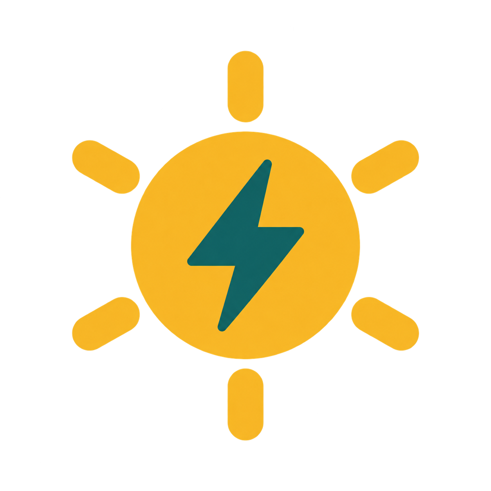

# SolarCost



SolarCost estimates electricity bills in Home Assistant using solar generation, household consumption, grid import and grid export. Enter your electricity tariff to track energy costs, export credit and optional fixed charges across daily, weekly, monthly and yearly periods.

SolarCost is a **custom integration compatible with HACS**. It runs locally inside Home Assistant and is configured through the UI. No separate Supervisor app or SolarCost cloud account is required.

**Tracking starts when you finish setup.** SolarCost does not import energy history recorded before installation. Bill estimates show charges accrued so far, rather than a forecast of the final bill.

## Requirements

- Home Assistant **2026.9.0 or later**.
- Four separate cumulative energy sensors for solar generation, household consumption, grid import and grid export.
- Your supplier's import prices, export payment and any applicable tariff times or fixed charges.
- HACS for the HACS installation method; manual installation is also supported.

## Installation

### Install with HACS

1. Open **HACS → ⋮ → Custom repositories**.
2. Add `https://github.com/jouwdan/solarcost` with the category **Integration**.
3. Find **SolarCost** in HACS and download it.
4. Restart Home Assistant.
5. Open **Settings → Devices & services → Add integration** and search for **SolarCost**.
6. Follow the setup steps below.

### Install manually

1. Download and extract the SolarCost repository or release archive.
2. Copy the `custom_components/solarcost` folder into the `custom_components` folder in your Home Assistant configuration directory. Create `custom_components` if it does not exist.
3. Check that the resulting path is `custom_components/solarcost/manifest.json`, without an extra nested `solarcost` folder.
4. Restart Home Assistant, then open **Settings → Devices & services → Add integration → SolarCost**.

No `configuration.yaml` entry is needed.

## Initial setup

### 1. Select your energy meters

Enter a name, a three-letter currency code such as `EUR`, `GBP` or `USD`, and select these four sensors:

| Field | Sensor to select |
| --- | --- |
| Solar generation energy meter | Total energy produced by your solar panels |
| Home consumption energy meter | Total energy used by your household |
| Grid import energy meter | Total energy purchased from the grid |
| Grid export energy meter | Total energy sent to the grid |

Each sensor must use **Wh, kWh or MWh** and have a state class of **`total` or `total_increasing`**. Use a different sensor for each field. Lifetime counters that update frequently give the best results. Daily counters can also work when their resets are reported correctly.

Select energy sensors, not instantaneous power sensors measured in W or kW. If your system only provides power sensors, first create Home Assistant **Integral helpers** to convert power readings into cumulative energy. Yesterday's totals, rolling totals, signed net import/export sensors and SolarCost's own sensors are not suitable sources.

For homes with batteries, use a measured household-consumption sensor. Calculating consumption as solar generation + grid import − grid export does not account for battery charging and discharging.

Check your Home Assistant time zone before setup. SolarCost keeps the currency and time zone selected at creation for that ledger; changing either requires a new setup with separate history.

### 2. Enter rates and reporting periods

Enter prices in your chosen currency. For example, enter `0.30` for a price of 30 cents per kWh.

| Setting | What to enter |
| --- | --- |
| Base import price per kWh | The price you pay outside any configured time bands |
| Base export payment per kWh | The payment you receive outside any configured time bands; use `0` if exports are unpaid |
| Daily standing charge | Optional fixed charge per day; leave at `0` if unused |
| Monthly levy / fixed charge | Optional fixed charge per calendar month; leave at `0` if unused |
| Extra VAT for tax-exclusive prices | Leave at `0` for prices that already include VAT; otherwise enter the percentage to add |
| Import energy discount | Optional percentage discount on imported energy; leave at `0` if unused or already included in your entered prices |
| Number of months to track | The size of the Last N months reporting window; default `12`, maximum `1,200` |
| Number of years to track | The size of the Last N years reporting window; default `5`, maximum `100` |

**VAT-inclusive prices are the default.** The optional VAT adjustment applies to discounted import costs, standing charges and monthly fixed charges. If you use it, enter those prices consistently before VAT. SolarCost does not apply VAT or discounts to export payments.

A positive export payment creates a credit that reduces the bill. Negative import and export prices are also supported.

The month and year settings control reporting windows, not data retention. Recorded history is kept when you change these settings.

### 3. Add time-of-use bands

For a flat-rate tariff, choose **Save** without adding bands. The base prices will apply all day.

For a time-of-use tariff, choose **Add a time band** and enter a unique name, start time, end time, starting weekdays, import price and export payment. Add up to 48 non-overlapping bands, then choose **Save**. If your export payment is constant, enter the same export price in every band.

Bands use local time and whole minutes. The start time is included; the end time is excluded. For a band crossing midnight, the selected weekday is the day the band starts. For example, a Monday band from 22:00 to 01:00 ends on Tuesday morning.

A cheaper EV period inside a night tariff needs separate night bands on either side so the times do not overlap. This example uses illustrative prices in currency units per kWh, with VAT already included:

| Rate or band | Applies | Import price | Export payment |
| --- | --- | --- | --- |
| Base rate | All times outside the bands below | 0.30 | 0.10 |
| Night before EV | Every day, 22:00–01:00 | 0.15 | 0.10 |
| EV | Every day, 01:00–04:00 | 0.08 | 0.10 |
| Night after EV | Every day, 04:00–07:00 | 0.15 | 0.10 |
| Peak | Every day, 16:00–19:00 | 0.40 | 0.10 |

Replace these example prices and times with your own tariff. SolarCost starts tracking when you save the completed setup.

## Add the dashboard card

The included [card template](custom_components/solarcost/card.yaml) displays today's bill, solar generation, household usage, grid import/export, bill totals for every reporting period, charges, current rates and a monthly energy chart. It uses built-in Home Assistant cards; no additional card plugins are required.

1. Open the [card.yaml template](custom_components/solarcost/card.yaml) and copy its contents. It is also included in the installed integration at `custom_components/solarcost/card.yaml`.
2. Open your dashboard and choose **Edit → Add card → By card → Manual**.
3. Paste the complete YAML, check the preview and save.

The template assumes the name **SolarCost** and the default 12-month and 5-year windows. If an entity is not found, look up its actual ID under **Settings → Devices & services → SolarCost → Entities** and update the YAML. You can remove any cards or charge rows you do not need.

The monthly chart fills as Home Assistant records statistics for the lifetime energy sensors. It may initially show **No statistics found**. The template is a starting point; you can also build your own dashboard from SolarCost's sensors.

## Understand your estimates

For each period, SolarCost provides solar generation, energy usage, grid import, grid export, import cost, export credit, standing charges, monthly fixed charges and the estimated bill.

| Period | Covers, in the configured local time zone |
| --- | --- |
| Today | Local midnight to now |
| This week | Monday midnight to now |
| This month | First day of this month to now |
| Last N months | First day of the month N−1 months ago to now |
| This year | January 1 to now |
| Last N years | January 1 of the year N−1 years ago to now |
| All time | First setup to now |

Last N months and Last N years include the current partial calendar period. For example, Last 3 months during September includes July, August and September so far. They are not fixed 30-day or 365-day windows.

```text
Estimated bill = import cost + standing charges + monthly fixed charges − export credit
```

A **negative estimated bill means net credit**. Amounts include the configured discount and VAT adjustment. Standing charges accrue through each day; monthly charges accrue across the actual days in each month. Setup partway through a day or month only includes charges from the tracking start time.

The **Current import rate** sensor shows the active import price after configured discounts and VAT. **Current export rate** shows the active export payment. Together with the period sensors, SolarCost creates 65 sensors per setup.

Open a bill sensor's attributes to see its cost breakdown, tracking start and meter status. `partial_history: true` means that the requested period starts before SolarCost began recording. Weekly, monthly and yearly totals may therefore match when you first install it.

## Change tariffs or meters

Open **Settings → Devices & services → SolarCost → Configure**. Choose **Rates and reporting periods**, **Time-of-use bands** or **Energy meters**, make your changes, then choose **Save changes**.

Saved tariff changes apply going forward. Previously recorded charges keep their original prices; changing a rate does not recalculate old bills. Changing a source meter keeps recorded totals and establishes a new starting reading for that source.

Use this menu when your supplier changes prices or you replace a meter. Currency and time zone remain fixed for the existing ledger.

## Get a report for specific dates

Use the **SolarCost: Get bill report** action to check a supplier's billing period or compare completed days, weeks, months or years.

1. Open **Developer tools → Actions** and select **SolarCost: Get bill report**.
2. Select the SolarCost integration to query.
3. Enter the start and end dates. Both dates are included, in the ledger's local time zone.
4. Choose grouping by **day**, **week**, **month** or **year**, then perform the action.

The response contains totals, a breakdown for each grouped period, currency, time zone, tracking start and partial-history information. Weeks start on Monday. The end date must be today or earlier, and a request can cover up to 100 years. Only data recorded since setup is available; a report ending today includes charges recorded so far.

For an automation, use an action such as:

```yaml
action: solarcost.get_report
data:
  config_entry_id: YOUR_SOLARCOST_ENTRY_ID
  start: "2026-01-01"
  end: "2026-01-31"
  group_by: month
response_variable: electricity_bill
```

Replace the entry ID and dates with your own values. The visual action editor lets you select your SolarCost integration without entering its ID manually. In an automation, the response is available in the `electricity_bill` variable for subsequent actions.

## Accuracy and limitations

SolarCost estimates when energy was used by spreading the increase between consecutive meter readings across the elapsed time. It splits that energy at tariff changes and local day boundaries. Frequent meter updates improve accuracy, particularly around tariff changes.

- Daylight-saving changes are handled in the configured time zone. Both occurrences of a repeated hour use the same local tariff, and a full local day accrues one daily standing charge.
- Missing or unavailable readings leave existing totals visible. Later cumulative readings can recover energy used during a gap, but cannot reveal its exact timing. Energy lost by a meter resetting during an outage cannot always be recovered.
- Decreases in a `total_increasing` sensor are treated as resets. Decreases in a `total` sensor establish a new baseline without subtracting previous charges. A faulty meter briefly reporting zero can resemble a reset.
- Supplier rounding, billing-specific levies, meter corrections and additional credits can cause differences from an invoice.
- Opening balances, payments, one-off credits, tiered usage prices and demand charges are not included.

SolarCost keeps its own daily history independently of Home Assistant's Recorder cleanup. Dashboard charts using Home Assistant statistics still depend on Recorder collecting the relevant sensors.

## Updates and backups

For HACS installations, install updates through HACS and restart Home Assistant. For manual installations, replace the integration files with the new version and restart.

Include the `solarcost` folder in your Home Assistant configuration directory in backups. Its databases are stored as `solarcost/<config_entry_id>.db`. For a manual file copy, stop Home Assistant first so the database is not being written during the copy.

Removing the integration does not delete its stored history. Adding it again creates a separate ledger; it does not automatically reconnect to the old database. Keep backups of old ledgers if you need their history.

## Troubleshooting

| Problem | What to check |
| --- | --- |
| SolarCost is missing from Add integration | Restart Home Assistant and check the installation path. `manifest.json` must be directly inside `custom_components/solarcost`. |
| A meter is rejected or missing from the selector | Check that it is an energy sensor in Wh, kWh or MWh with state class `total` or `total_increasing`. Use four distinct sensors. |
| Energy totals start at zero | This is expected. SolarCost starts from each meter's current reading and counts subsequent increases. Earlier meter totals are not imported. |
| The dashboard says Entity not found | Replace the example entity ID with the one shown in your SolarCost entity list. |
| The monthly chart is empty | Allow time for Home Assistant to collect statistics, and check that Recorder includes the SolarCost lifetime energy sensors. |
| A bill has partial history or several periods show the same total | The period may start before SolarCost was installed. Check the bill sensor's `tracking_since` and `partial_history` attributes. |
| Costs stop updating | Check the source sensors. A bill sensor's `source_status` and `meter_diagnostics` attributes show unavailable or invalid sources and the last accepted readings. |
| The active rate looks wrong | Check the local time zone, selected weekdays and band boundaries. The current import rate already includes configured discounts and VAT. |
| VAT or a discount appears to be applied twice | Leave the corresponding adjustment at `0` if it is already included in the prices you entered. |

For problems that remain, check **Settings → System → Logs** and [open an issue](https://github.com/jouwdan/solarcost/issues). Include your Home Assistant and SolarCost versions, the steps to reproduce the problem, and relevant logs with credentials and personal details removed.

## License

SolarCost is available under the [MIT License](LICENSE).
